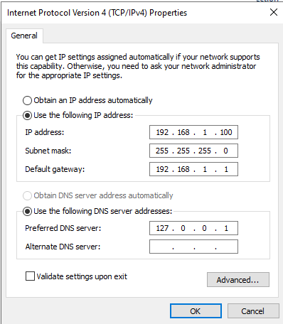
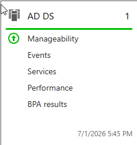
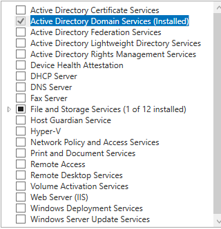

# Module 1 — Active Directory & Domain Controller

[← Back to Main README](./README.md)

## Objective

Install Active Directory Domain Services on Windows Server 2022 and promote the server to a Domain Controller, establishing the `lab.local` domain as the central authentication and management authority for the lab environment.

---

## Background

Active Directory Domain Services is the directory service that powers identity and access management in virtually every enterprise Windows environment. It stores information about users, computers, and resources and controls who has access to what. 

A Domain Controller is the server that runs AD DS and serves as the authority for the domain. Every login, group policy application, and resource access request passes through the Domain Controller.

---

## Steps Performed

### 1. Configured Static IP and Renamed Server

Before installing AD DS the server was given a static IP address and renamed to reflect its role:

| Setting | Value |
|---------|-------|
| IP Address | 192.168.1.100 |
| Subnet Mask | 255.255.255.0 |
| Default Gateway | 192.168.1.1 |
| Preferred DNS | 127.0.0.1 |
| Server Name | DC01 |

The DNS was pointed to `127.0.0.1` so the server uses itself for DNS resolution, standard configuration for a Domain Controller.

### 2. Installed Active Directory Domain Services Role

Installed the AD DS role through Server Manager using the Add Roles and Features wizard. This installs the binaries and tools required to run Active Directory but does not yet create the domain.

### 3. Promoted Server to Domain Controller

Used the Active Directory Domain Services Configuration Wizard to promote the server to a Domain Controller with the following configuration:

| Setting | Value |
|---------|-------|
| Deployment operation | Add a new forest |
| Root domain name | lab.local |
| Forest functional level | Windows Server 2016 |
| Domain functional level | Windows Server 2016 |
| DNS Server | Enabled |
| Global Catalog | Enabled |

After promotion the server automatically restarted and the login screen changed to reflect `LAB\Administrator` confirming the domain was successfully created.

---

## Key Concepts

**Why a static IP on the Domain Controller?**
Every machine on the domain finds the Domain Controller by its IP address for authentication and DNS. If the DC's IP changes client machines can't find it then logins fail, Group Policy stops applying, and the domain breaks. Static IPs on domain controllers are non-negotiable in any production environment.

**Why point DNS to 127.0.0.1?**
The Domain Controller is also the DNS server for the domain. Pointing it to itself means it handles all internal DNS resolution. External DNS queries are forwarded upstream to a public DNS server like Google's `8.8.8.8` via DNS forwarders.

**What is a forest?**
A forest is the top-level container in Active Directory. It can contain one or more domains. Most small and mid-size companies run a single forest with a single domain which is exactly the setup in this lab.

**What is the Global Catalog?**
The Global Catalog is a distributed data store that contains a partial replica of all objects in the forest. It's used to speed up searches across the domain and is required for user logins in multi-domain environments.

---

## Real-World Relevance

- Active Directory is used by the vast majority of enterprises running Windows infrastructure
- Domain Controller deployment is performed by sysadmins when setting up new offices, subsidiaries, or environments
- Understanding AD DS architecture is a baseline expectation for IT help desk, sysadmin, and security roles in Windows environments
- The static IP and DNS configuration performed here are the first steps in every real DC deployment checklist
