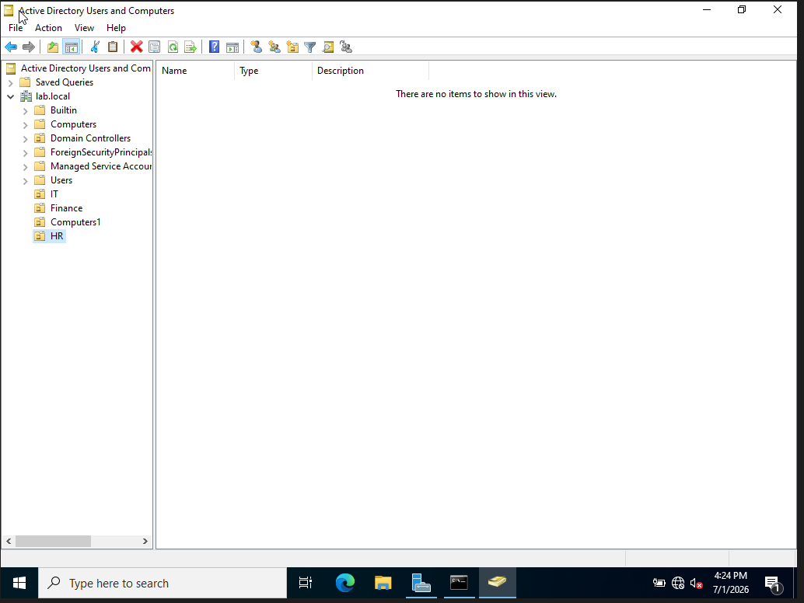
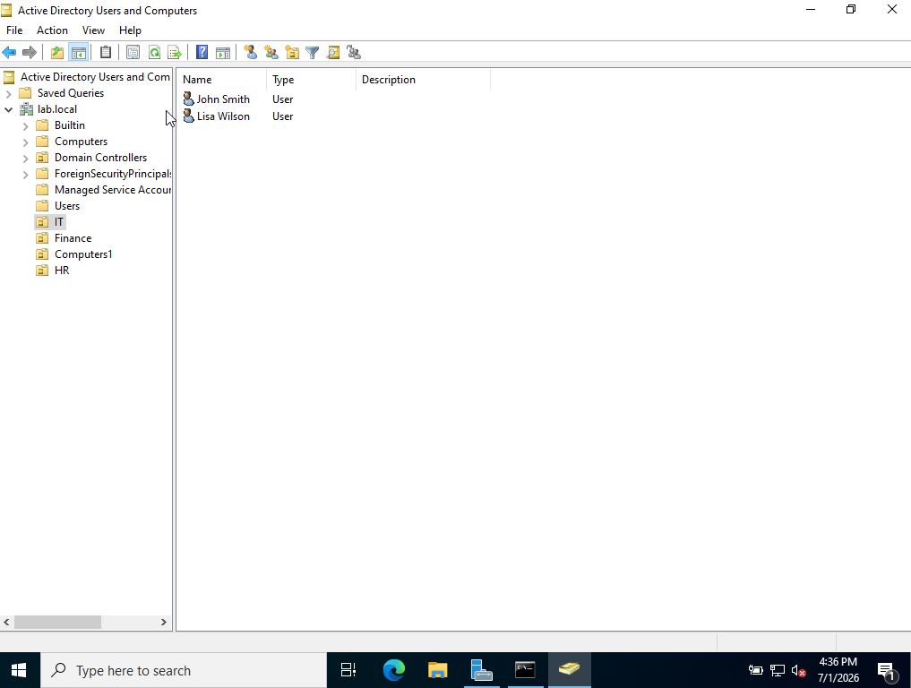
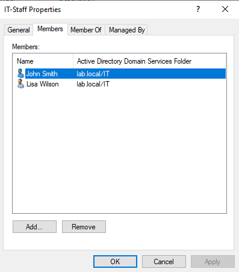
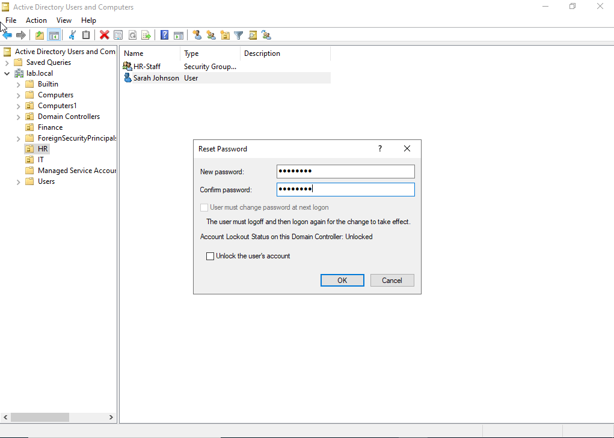
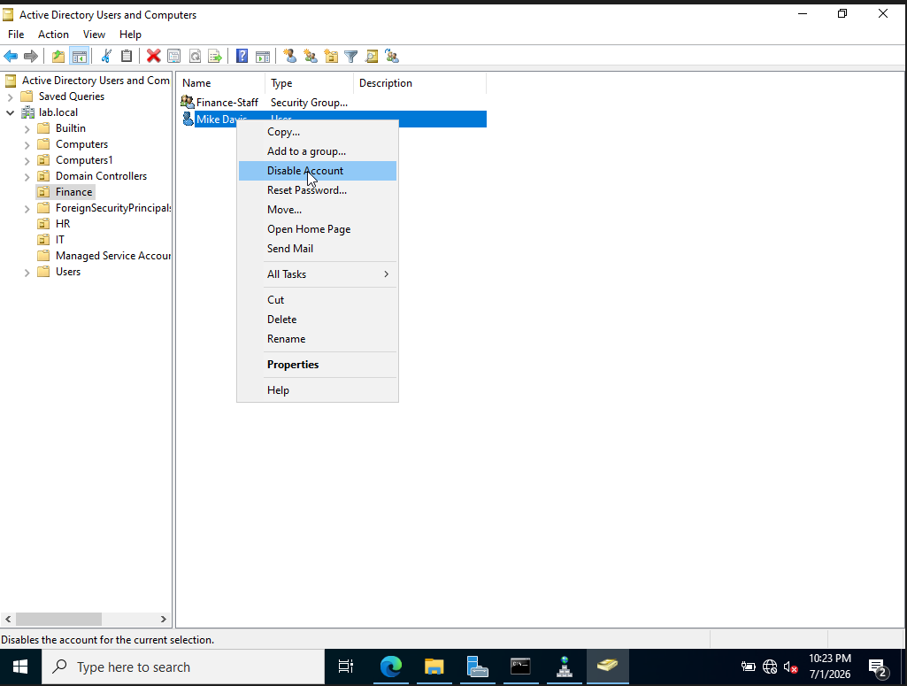
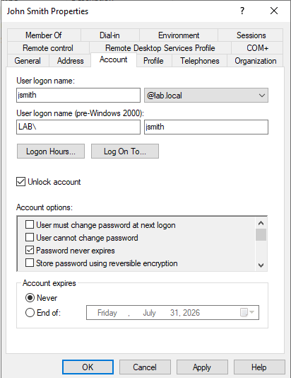

# Module 2 — User & Group Management

[← Back to Main README](./README.md)

## Objective

Design and implement an organizational unit structure in Active Directory, create user accounts and security groups for four departments, and practice the most common help desk tasks: password resets, account unlocks, and account disables.

---

## Background

User and group management is the most frequent daily task for IT help desk technicians in any Windows environment. Every new employee needs an account created and placed in the correct OU. Every departure needs an account disabled. Every forgotten password needs a reset. Understanding how to perform these tasks quickly and correctly in Active Directory is a baseline expectation for any help desk role.

---

## Organizational Unit Structure

OUs are containers inside Active Directory that organize users, computers, and groups by department or function. They are also the mechanism by which Group Policy gets applied to specific sets of users.

    lab.local
    ├── IT
    │   ├── jsmith (John Smith)
    │   ├── lwilson (Lisa Wilson)
    │   └── IT-Staff (Security Group)
    ├── HR
    │   ├── sjohnson (Sarah Johnson)
    │   └── HR-Staff (Security Group)
    ├── Finance
    │   ├── mdavis (Mike Davis)
    │   └── Finance-Staff (Security Group)
    └── Computers

---

## Steps Performed

### 1. Created Organizational Units

Created four OUs under `lab.local` to reflect a standard department structure:

- `IT` — Information Technology staff
- `HR` — Human Resources staff
- `Finance` — Finance department staff
- `Computers` — Domain-joined computer accounts

### 2. Created User Accounts

Created four user accounts placed in their respective department OUs:

| Full Name | Username | Department | OU |
|-----------|----------|------------|----|
| John Smith | jsmith | IT | IT |
| Lisa Wilson | lwilson | IT | IT |
| Sarah Johnson | sjohnson | HR | HR |
| Mike Davis | mdavis | Finance | Finance |

### 3. Created Security Groups and Added Members

Created one security group per department and added users to their respective groups:

| Group Name | Members | Scope | Type |
|------------|---------|-------|------|
| IT-Staff | jsmith, lwilson | Global | Security |
| HR-Staff | sjohnson | Global | Security |
| Finance-Staff | mdavis | Global | Security |

### 4. Performed Common Help Desk Tasks

#### Password Reset — sjohnson
Simulated a user who forgot their password. Reset via right click → Reset Password with "User must change password at next logon" enforced.

#### Account Disable — mdavis
Simulated an employee departure. Disabled the account via right click → Disable Account. A down arrow icon appears on the user confirming the account is disabled.

#### Account Unlock — jsmith
Simulated a user locked out after too many failed login attempts. Located the Unlock Account checkbox under the user's Account tab in Properties.

---

## Key Concepts

**Why use OUs instead of just putting everyone in the default Users container?**
The default Users container cannot have Group Policy applied to it directly. OUs give you the ability to apply targeted GPOs to specific departments, delegate administrative control to specific admins, and organize the directory in a way that mirrors the company structure.

**Why security groups instead of assigning permissions directly to users?**
Assigning permissions directly to individual users creates an unmanageable mess as the organization grows. With groups you add a user to a group and they instantly inherit all the permissions that group has. Remove them from the group and access is revoked immediately. This is the same least privilege principle applied at the operating system level.

**Why check "User must change password at next logon" during a password reset?**
When a help desk technician resets a password they temporarily know the user's credentials. Forcing a change at next logon ensures the user sets their own private password immediately ensures the technician never has long-term knowledge of the user's password. This is standard security practice and is required by compliance frameworks like SOC 2.

**What is the difference between Global, Universal, and Domain Local groups?**
- Global groups — contain users from the same domain, used to organize users by role or department
- Domain Local groups — used to assign permissions to resources within the domain
- Universal groups — span multiple domains in a forest, used in large multi-domain environments

For a single domain lab environment Global groups are the correct and standard choice.

---

## Real-World Relevance

- Password resets are the single most common help desk ticket in any Windows environment
- Account disables at employee departure are a critical security control. Aactive accounts for former employees are a leading cause of unauthorized access
- OU design directly impacts how efficiently Group Policy can be managed across the organization
- Security group membership is audited regularly in security assessments. Overly permissive group memberships are a top finding in Active Directory security reviews
