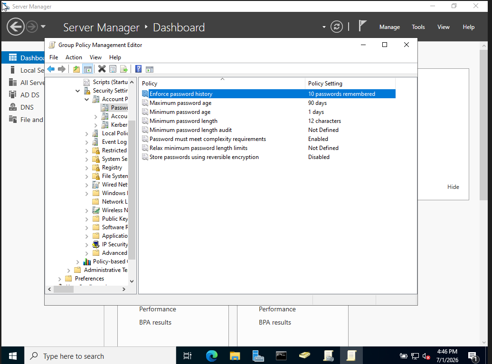
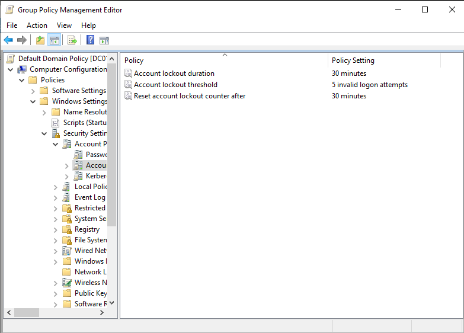
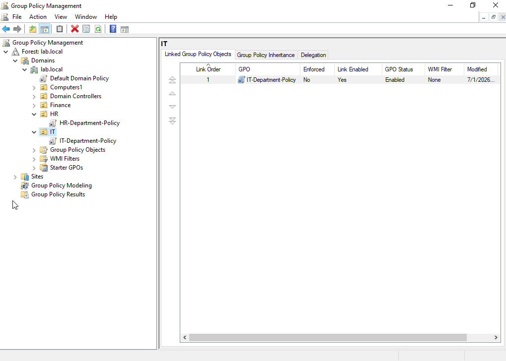
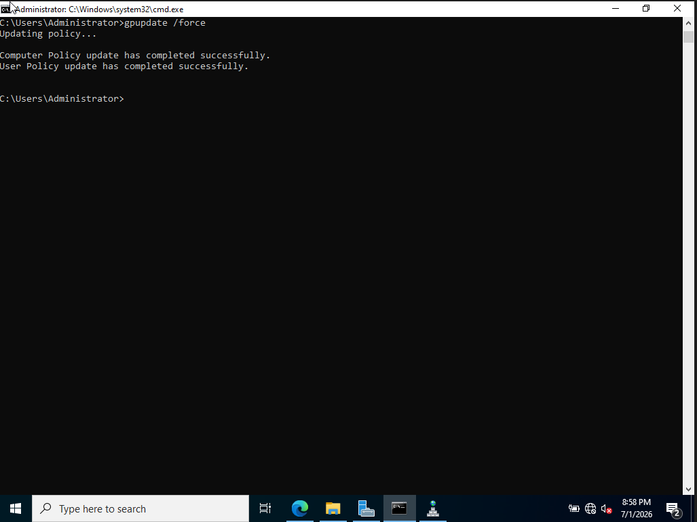

# Module 3 — Group Policy

[← Back to Main README](./README.md)

## Objective

Create and configure Group Policy Objects to enforce password and account lockout policies across the entire domain, and implement targeted department-level policies that give IT staff elevated access while restricting HR staff from unnecessary system settings.

---

## Background

Group Policy is the mechanism Windows administrators use to enforce settings across an entire organization from one central location. Instead of configuring each machine individually, a GPO is created once and automatically applies to every user and computer in the linked OU or domain. This is how companies ensure every machine meets security standards, restrict access to sensitive settings, and enforce compliance requirements at scale.

---

## Steps Performed

### 1. Configured Domain-Wide Password Policy

Edited the Default Domain Policy to enforce password requirements across all users in the domain. Navigated to:

    Computer Configuration → Policies → Windows Settings →
    Security Settings → Account Policies → Password Policy

| Setting | Value | Purpose |
|---------|-------|---------|
| Minimum password length | 12 characters | Prevents short easily guessed passwords |
| Maximum password age | 90 days | Forces regular password rotation |
| Minimum password age | 1 day | Prevents users from immediately changing back |
| Password must meet complexity requirements | Enabled | Requires uppercase, lowercase, numbers, symbols |
| Enforce password history | 10 passwords | Prevents reuse of recent passwords |

### 2. Configured Account Lockout Policy

Configured account lockout settings under the Default Domain Policy to protect against brute force attacks. Navigated to:

    Computer Configuration → Policies → Windows Settings →
    Security Settings → Account Policies → Account Lockout Policy

| Setting | Value | Purpose |
|---------|-------|---------|
| Account lockout threshold | 5 invalid attempts | Locks account after 5 wrong passwords |
| Account lockout duration | 30 minutes | Account stays locked for 30 minutes |
| Reset account lockout counter after | 30 minutes | Counter resets after 30 minutes of no attempts |

### 3. Created Department-Specific GPOs

Created targeted GPOs linked to individual OUs to apply different settings to different departments — demonstrating best practice GPO design.

**IT-Department-Policy — linked to IT OU**

Configured Control Panel access as Disabled (meaning IT staff CAN access Control Panel). IT technicians need full system access to do their jobs.

**HR-Department-Policy — linked to HR OU**

Configured Control Panel access as Enabled (meaning HR staff CANNOT access Control Panel). Regular employees have no business need to modify system settings.

### 4. Forced Group Policy Update

Ran gpupdate /force on the Domain Controller to immediately push all policy changes rather than waiting for the standard 90 minute refresh cycle.

    gpupdate /force

---

## Key Concepts

**Default Domain Policy vs custom GPOs**
The Default Domain Policy applies to every user and computer in the domain — it is the right place for universal settings like password and lockout policy. Custom GPOs linked to specific OUs are the right place for department-level settings. Mixing everything into the Default Domain Policy makes it difficult to manage and troubleshoot.

**GPO processing order — LSDOU**
Group Policy is processed in this order: Local → Site → Domain → OU. This means OU-linked policies are processed last and take precedence over domain-wide policies for users in that OU. Understanding processing order is essential for troubleshooting why a policy isn't applying as expected.

**Why restrict Control Panel for standard users?**
Control Panel gives users access to network settings, user account management, and system configuration. A standard employee modifying these settings can accidentally misconfigure their machine, create security gaps, or install unauthorized software. Restricting it reduces the attack surface and prevents accidental misconfigurations.

**gpupdate /force**
In production environments Group Policy refreshes automatically every 90 minutes for computers and at logon for users. Running gpupdate /force immediately applies all current policies without waiting — this is the first troubleshooting step when a policy change doesn't seem to be taking effect on a machine.

---

## Real-World Relevance

- Password and lockout policies are required by virtually every compliance framework including SOC 2, PCI-DSS, HIPAA, and NIST
- GPO troubleshooting is a frequent help desk and sysadmin task — users regularly report that settings aren't applying correctly
- Department-level GPO design is standard practice in enterprise environments with hundreds or thousands of users
- The gpupdate /force command is one of the most commonly used tools in Windows IT administration
