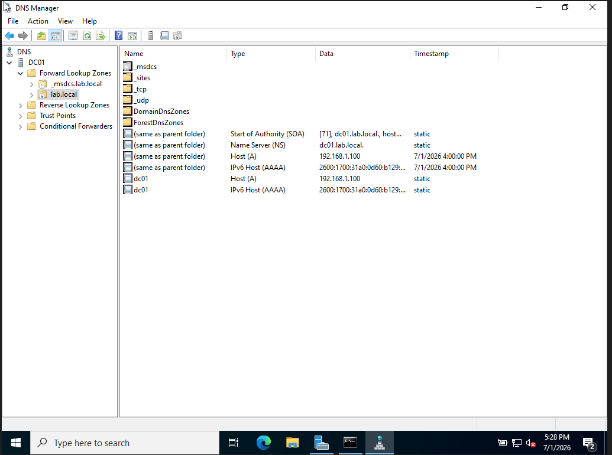
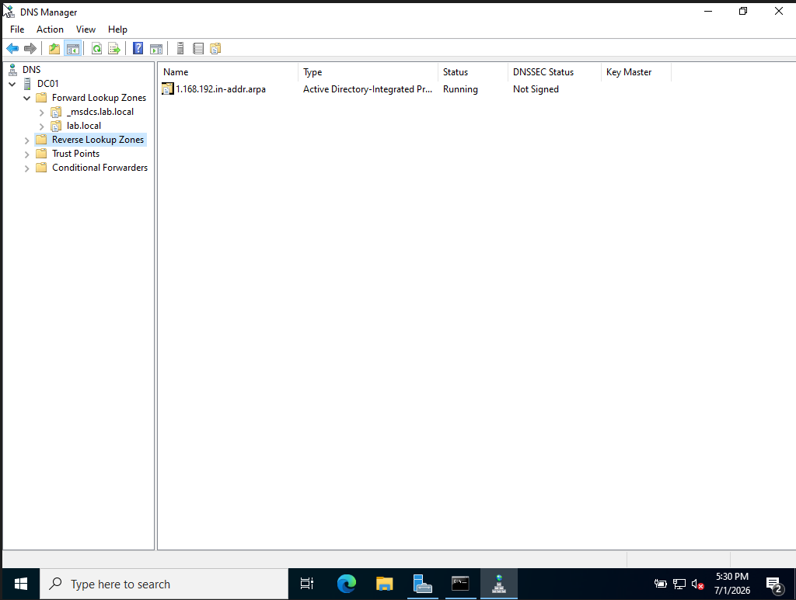
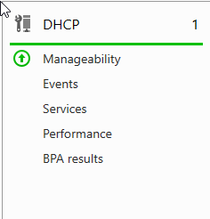
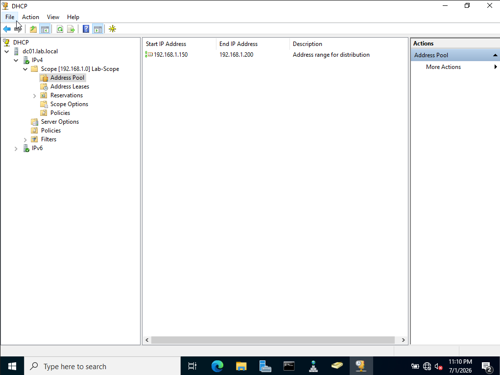

# Module 4 — DNS & DHCP

[← Back to Main README](./README.md)

## Objective

Verify DNS is correctly configured for the domain, create a reverse lookup zone for IP-to-hostname resolution, install and configure DHCP to automatically assign IP addresses to client machines, and create a DHCP scope for the lab network.

---

## Background

DNS and DHCP are the two services that keep a network running. DNS translates hostnames to IP addresses so machines can find each other by name. DHCP automatically assigns IP addresses to devices so they don't need to be configured manually. When a help desk ticket comes in saying "I can't connect to the network" or "I can't reach the file server" — DNS and DHCP are almost always the first place to look.

---

## Steps Performed

### 1. Verified DNS Forward Lookup Zone

DNS was automatically installed and configured when the server was promoted to a Domain Controller in Module 1. Opened DNS Manager and verified the forward lookup zone for `lab.local` was correctly configured with the required records.

Key DNS records verified in `lab.local`:

| Record Type | Name | Value | Purpose |
|-------------|------|-------|---------|
| SOA | (same as parent) | dc01.lab.local | Declares DC01 as authoritative DNS server |
| NS | (same as parent) | dc01.lab.local | Name server record for the domain |
| A | dc01 | 192.168.1.100 | Maps DC01 hostname to its IP address |
| AAAA | dc01 | 2600:1700:... | IPv6 record for DC01 |

### 2. Created Reverse Lookup Zone

Created a reverse lookup zone to enable IP-to-hostname resolution — the opposite of what forward lookup does.

| Setting | Value |
|---------|-------|
| Zone type | Primary zone |
| Replication | All DNS servers in the domain |
| Network ID | 192.168.1 |
| Zone name | 1.168.192.in-addr.arpa |

### 3. Configured DNS Forwarders

Added public DNS forwarders so the Domain Controller can resolve external domain names while still handling all internal `lab.local` queries itself.

| Forwarder | Purpose |
|-----------|---------|
| 8.8.8.8 | Google Primary DNS |
| 8.8.4.4 | Google Secondary DNS |

When a DNS query comes in the server first checks if it can answer from its own zones. If not it forwards the query to Google's DNS for resolution. This is standard configuration for any production Domain Controller.

### 4. Installed DHCP Server Role

Installed the DHCP Server role through Server Manager and completed the post-installation authorization process to allow the DHCP server to operate on the domain.

### 5. Created DHCP Scope

Created a DHCP scope to define the range of IP addresses automatically assigned to client machines on the network.

| Setting | Value |
|---------|-------|
| Scope name | Lab-Scope |
| Start IP | 192.168.1.150 |
| End IP | 192.168.1.200 |
| Subnet mask | 255.255.255.0 |
| Default gateway | 192.168.1.1 |
| DNS server | 192.168.1.100 |
| Lease duration | 8 days |
| Status | Active |

The scope provides 51 available IP addresses for client machines. The DC's static IP of `192.168.1.100` sits outside this range deliberately — static IPs should always be excluded from or sit outside the DHCP scope to prevent conflicts.

---

## Key Concepts

**Forward vs reverse lookup zones**
A forward lookup zone resolves hostnames to IP addresses — "what is the IP of dc01.lab.local?" A reverse lookup zone resolves IP addresses back to hostnames — "what is the hostname of 192.168.1.100?" Reverse lookup is used by security tools, monitoring systems, and log analysis to make IP addresses human readable.

**Why does the DC point DNS to itself (127.0.0.1)?**
The Domain Controller is the authoritative DNS server for the domain. It must use itself for DNS so it can resolve internal domain names like `dc01.lab.local`. DNS forwarders handle external resolution — the DC answers internal queries itself and passes everything else to Google.

**APIPA addresses — 169.254.x.x**
When a device can't reach a DHCP server it assigns itself an Automatic Private IP Address in the 169.254.0.0/16 range. If a user reports their IP starts with 169.254 it means DHCP failed — the scope may be exhausted, the DHCP service may be stopped, or there may be a network connectivity issue between the client and server. This is one of the most common network troubleshooting scenarios at the help desk.

**DHCP lease duration**
A lease is how long a client keeps an assigned IP before it must renew with the DHCP server. Short leases (1-2 days) work well in environments with lots of device turnover like conference rooms or guest networks. Longer leases (8 days as configured here) work better for stable environments where devices are always the same.

**Why keep static IPs outside the DHCP scope?**
If a server has a static IP of 192.168.1.100 and the DHCP scope includes that address, DHCP might assign 192.168.1.100 to a client machine — creating an IP conflict that breaks connectivity for both devices. Always place static IPs either outside the scope range or add them as exclusions within the scope.

---

## Real-World Relevance

- DNS troubleshooting is one of the most common help desk and network admin tasks — "it was working yesterday" is almost always a DNS issue
- DHCP scope management is required whenever a company adds a new network segment, opens a new office, or runs out of available addresses
- Understanding APIPA addresses allows help desk technicians to immediately identify DHCP failures from a user's IP address alone
- Reverse lookup zones are used by security teams during incident investigations to map IP addresses in logs back to specific machines
